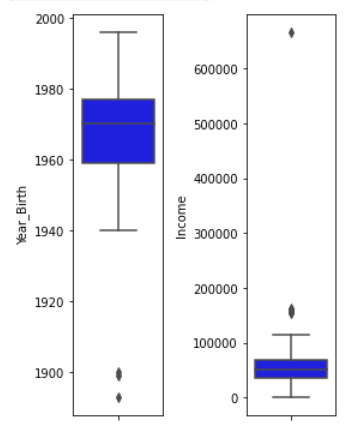
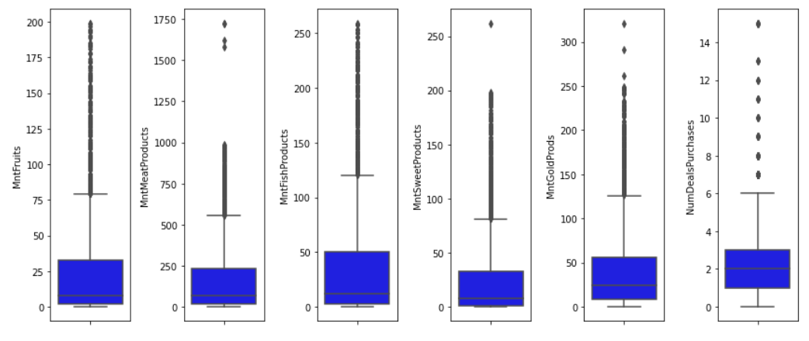
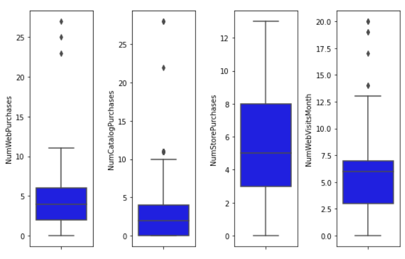
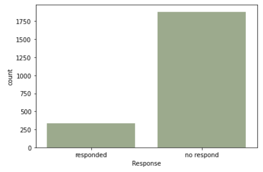
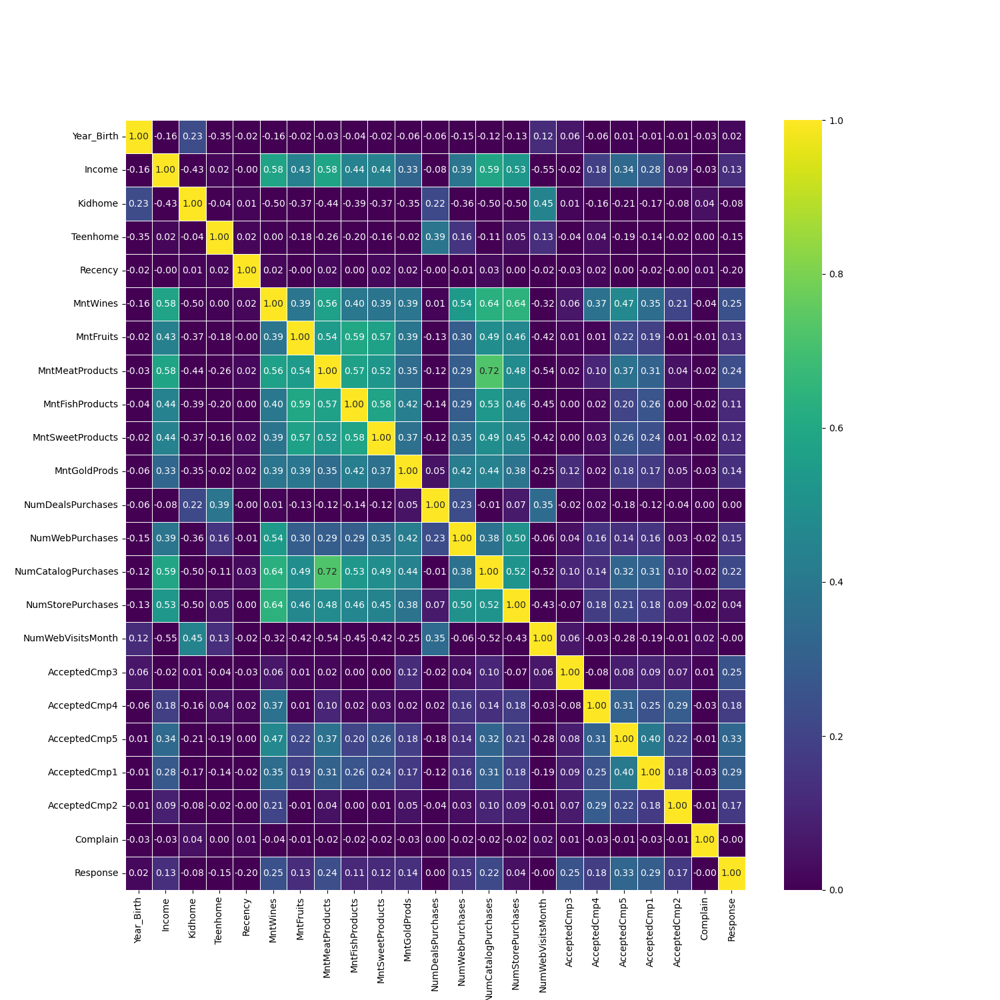

# Final Project: Marketing Campaign

Kelompok 9 Halcyon  
Rakamin Academy Data Science Bootcamp Batch 28:  
1. Aditya Ridwan
2. Ann Sinaga
3. Irvandri Lawinata
4. Jesslyn Jane
5. Lhutfia Ichsan
6. M. Triargi
7. Mustiadi Zakki

Datataset dapat diakses pada [Marketing Campaign Dataset](https://www.kaggle.com/datasets/rodsaldanha/arketing-campaign)

## 1. Problem Statement
Sebuah perusahaan diketahui memiliki tingkat acceptance marketing campaign sekitar 14.91%, yang mana hal tersebut masih dianggap kurang oleh manajemen dalam menghadapi persaingan bisnis. 

Sehingga pihak manajemen meminta tim marketing untuk meningkatkan lagi tingkat acceptance marketing campaign tersebut agar cost yang dikeluarkan perusahaan dalam melakukan marketing campaign lebih efisien dan jumlah revenue yang mereka raih pada tahun-tahun berikutnya meningkat.

Maka dari itu, tim marketing berencana menerapkan strategi Targeted Marketing dengan bantuan tim data science untuk mengolah data historis penjualan yang telah mereka rekap sebelumnya dan mengelompokkan user ke dalam sebuah kategori tertentu sesuai dengan karakteristiknya masing-masing, sehingga dapat dipilah antara yang layak mendapatkan campaign dengan yang tidak mendapatkan campaign.

## 2. Objective, Business Metrics dan Goal
Objective:
Membuat sistem prediksi model klasifikasi/clustering yang dapat menentukan targeting user yang tepat. Dengan ini tentu akan memperbesar nilai business metrics yang telah ditentukan seperti traffic dan sales performance. Sistem sudah menentukan mana user yang memang sedang tertarik atau bagian dari market untuk campaign yang akan dijalankan.

Business Metrics:
1. Response rate
2. Revenue rate

Goal:  
Dapat meningkatkan response rate campaign perusahaan, sehingga profit perusahaan dapat meningkat. 

## 3. Exploratory Data Analysis (EDA)
### Descriptive Analysis
Dataset terdiri atas 28 feature dan 1 target, yaitu Rensponse(rasio jumlah customer yang merespon dibandingkan dengan total impresi campaign)

### Univariate Analysis

Dengan menggunakan boxplot, ditemukan adanya outlier pada feature Year_Birth dan Income.

Selain itu, ditemukan juga outlier pada feature pembelian barang ('MntWines', 'MntFruits', 'MntMeatProducts', 'MntFishProducts', 'MntSweetProducts','MntGoldProds'). 

Begitu pula dengan feature purchases ('NumWebPurchases','NumCatalogPurchases','NumStorePurchases',' NumWebVisitsMonth') juga ditemukan outlier. 

> Sementara pada category-plot terdapat insight menarik pada feature response yaitu adanya ketimpangan antara customer yang merespon dengan tidak merespon. Hal ini menunjukkan adanya class imbalance, dimana nantinya harus dilakukan over/undersampling pada tahap pre-processing.

### Multivariate Analysis

> Dari heatmap plot, terlihat feature AcceptedCmp1 dan AcceptedCmp5 punya korelasi paling tinggi dengan target response dengan nilai masing-masing 0.33 dan 0.29.

Dan berikut merupakan beberapa feature yang kemungkinan akan kami pertahankan dan gunakan untuk analisis kedepannya:
- Recency
- MntWines
- MntMeatProducts
- NumCatalogPurchases
- AcceptedCmp3
- AcceptedCmp5
- AcceptedCmp1 

> Dari seluruh korelasi antara feature-target, seluruhnya berada di range 0.00 sampai 0.33. Oleh karena itu, kami memutuskan untuk membuat nilai threshold di angka 0.20. Feature-feature di atas yang kami pertahankan adalah feature yang memiliki nilai korelasi >0.20.

Selain itu, berdasarkan analisa awal antar-fitur yang kami lakukan terhadap fitur yang memiliki korelasi lebih tinggi dengan target, didapatkan hasil sebagai berikut:

*[Recency]*: Nilai korelasi Recency dengan feature lainnya memiliki range 0.00 sampai 0.05

*[MntWines]*: Berikut adalah feature yang berkorelasi dengan MntWines: Income(0.58), NumCatalogPurchases(0.64), NumStorePurchases(0.64)

*[MntMeatProducts]*: Berikut adalah feature yang berkorelasi dengan MntMeatProducts: NumCatalogPurchases(0.72), Income(0.58), MntWines(0.56)

*[NumCatalogPurchases]*: Berikut adalah feature yang berkorelasi dengan NumCatalogPurchases: MntMeatProducts(0.72), MntWines(0.64),Income(0.59)

*[AcceptedCmp3]*: Berikut adalah feature yang berkorelasi dengan AcceptedCmp3: MntGoldProducts(0.12)

*[AcceptedCmp5]*: Berikut adalah feature yang berkorelasi dengan AcceptedCmp5: MntWines(0.47), MntMeatProducts(0.37), Income(0.34)

*[AcceptedCmp1]*: Berikut adalah feature yang berkorelasi dengan AcceptedCmp1: AcceptedCmp5(0.40), MntWines(0.35), MntMeatProducts(0.31), NumCatalogPurchases(0.31)

> Dari hasil tersebut, kemungkinan besar nantinya akan kami gunakan sebagai fitur prioritas dalam keputusan penentuan indikator pendukung untuk pengkategorisasian customer mana yang layak diberikan campaign.

## 4. Business Insights & Recommendations
### Business Insights
- Bagaimana pengaruh memiliki kidhome dan teenhome terhadap tingkat respon customer?

- Bagaimana persentase customer yang Respon dan Tidak Respon dengan status pernikahan?

- Bagaimana persentase customer yang Respon dan Tidak Respon dengan education level?

### Business Recommendations
Berdasarkan data visualisasi, maka tim Data Scientist dapat memberikan rekomendasi untuk tim marketing, berupa:

- Dari visualisasi kidhome dan teenhome, dapat dilihat bahwa customer yang merespon terbanyak berasal dari customer yang tidak mempunyai anak dan tidak mempunyai remaja (0.265403), sehingga marketing team dapat memfokuskan campaign ke customer yang tidak mempunyai anak dan tidak mempunyai remaja.
- Dari visualisasi piechart Marital Status, dapat dilihat bahwa customer yang merespon terbanyak berasal dari customer yang berstatus Absurd (50%) dan Yolo(50%), disusul dengan Alone(33%) dan Widow (25%), sehingga marketing team dapat memfokuskan campaign ke customer "Absurd" dan "Yolo".
- Dari visualisai piechart Education, dapat dilihat bahwa customer yang merespon terbanyak berasal dari customer yang memiliki edukasi PhD (20.78%), disusul dengan Master (15.41%), sehingga marketing team dapat memfokuskan campaign ke customer yang beredukasi "PhD".

### Next Improvement
Selain dari tiga business insight tersebut, kami juga memiliki satu buah insight lagi berupa sebuah trend suatu product yang memiliki korelasi kuat (Gold, Meat, dan Wines) terhadap campaign 1 sampai dengan campaign 5. Kemudian, hasil dari visualisasi insight tersebut nantinya dapat digunakan oleh perusahaan untuk memprioritaskan produk mana yang akan dijual atau dipromosikan guna menarik jumlah customer. Sehingga diharapkan dengan adanya kenaikan jumlah customer tersebut, jumlah revenue perusahaan pun dapat bertambah.

Namun, dikarenakan keterbatasan waktu, kami belum sempat membuat visualisasi insight terakhir tersebut dan berencana untuk menjadikannya sebagai next improvements.

## 5. Data PreProcessing
### Data Cleansing & Feature Engineering
#### Handle Missing Values

> Berdasarkan hasil analisa awal, dapat diketahui bahwa terdapat data kosong pada kolom income sebanyak 24 baris dengan persentase sebesar 1,07% dari keseluruhan data, yang berarti tergolong jauh di bawah batas aman penghapusan data (10%). Sehingga keputusan yang kami lakukan terhadap missing value tersebut, yaitu dengan menghapus keseluruhan baris pada kolom Income yang memiliki nilai null (kosong)

#### Handle Duplicated Data
> Berdasarkan hasil pengecekan, tidak ditemui baris data yang memiliki duplikat. Sehingga kami tidak perlu melakukan handling duplicated data

#### Handle Outliers

> Berdasarkan grafik yang telah ditampilkan di atas, terlihat bahwa adanya outliers pada fitur 'Income', 'Year_Birth', 'Recency', 'MntWines', 'MntFruits', 'MntMeatProducts', 'MntFishProducts', 'MntSweetProducts', 'MntGoldProds', 'NumDealsPurchases', 'NumWebPurchases', 'NumWebVisitsMonth'. Sehingga, kami melakukan perbaikan pada fitur tersebut dengan menggunakan metode Z-score dan juga IQR untuk meminimalisir jumlah outliers yang terkandung dalam dataset.

##### Remove Outliers berdasarkan Z-score

##### Remove Outliers berdasarkan IQR

> Berdasarkan hasil perhitungan menggunakan Z-score dan juga IQR, dapat diketahui bahwa jumlah baris yang dihapus berdasarkan IQR jauh lebih banyak dibandingkan dengan Z-score, yaitu sekitar >30% dari total baris data yang dihapus. Maka dari itu, kami memutuskan untuk memilih metode Z-score untuk melakukan penghapusan pada baris outliers.

Setelah itu, kami melakukan plotting boxplot untuk melihat kembali persebaran outliers pada masing-masing fitur.

#### Feature Transformation

> Berdasarkan grafik yang telah ditampilkan di atas, terlihat bahwa adanya positively skewed pada fitur 'MntWines', 'MntFruits', 'MntMeatProducts', 'MntFishProducts', 'MntSweetProducts', 'MntGoldProds', 'NumDealsPurchases', 'NumWebPurchases', 'NumCatalogPurchases'. Sehingga, kami melakukan perbaikan pada feature tersebut dengan teknik feature transformation menggunakan metode log transformation.

##### Log Transformation

> Berdasarkan hasil pengecekan pada beberapa fitur yang telah diproses menggunakan log transformation sebelumnya, dapat diketahui bahwa keseluruhan nilai skewnessnya sudah memiliki rentang yang lebih seragam (tidak jauh dan tidak terlalu bervariasi). Sehingga dapat disimpulkan bahwa teknik fitur transformation yang telah kami lakukan sudah valid dan kami memutuskan untuk membuat kolom baru dengan isian nilai pada fitur yang sudah diolah tersebut.

#### Feature Encoding
Setelah melakukan feature transformation, disini kami juga memutuskan untuk melakukan feature encoding pada kolom yang memiliki tipe data categorical untuk diubah menjadi numerical. Hal ini kami lakukan dengan harapan agar kemampuan machine learning yang kami buat dapat meningkat. Berikut merupakan beberapa feature yang kami olah pada tahap ini:

1. Mapping_marital, based on Marital_status
2. Mapping_education, based on Education

##### Label Encoding
Mapping_marital, based on Marital_status

Mapping_education, based on Education

##### One Hot Encoding

#### Feature Extraction
> Setelah melakukan feature encoding, disini kami juga memutuskan untuk melakukan feature extraction. Hal ini kami lakukan dengan tujuan untuk mempermudah tahapan feature selection yang akan dilakukan selanjutnya. Berikut merupakan beberapa feature yang kami ciptakan pada tahap ini:
1. primer_purcahase & tersier_purchase, yaitu sebuah fitur yang menggabungkan kolom pembelian buah, daging dan ikan, wine, makanan manis, dan gold ke dalam 2 golongan, yaitu primer dan tersier.
2. total_accepted_campaign, yaitu sebuah fitur yang menggabungkan acceptedcmp 1 - 5. Fitur ini dibuat untuk melihat intensitas customer dalam accepting campaign dari keseluruhan campaign yang telah dilakukan oleh perusahaan.
3. total_revenue, yaitu sebuah fitur yang dibuat dengan menjumlahkan total acceptence customer pada keseluruhan campaign sebelumnya (1-5) dengan jumlah revenue per accepted campaign.
4. total_spent, yaitu sebuah fitur yang menggabungkan total pembelian pada keseluruhan produk darimulai wines, fruits, meat, fish, sweet, sampai dengan gold untuk merekap total pengeluaran yang telah dilakukan oleh masing-masing customer.
5. total_order, yaitu sebuah fitur yang berisikan summary dari total purchases atau order yang telah dilakukan oleh pelanggan dari berbagai metode purchases.
6. month_customer, yaitu fitur bulan dimana customer mulai enroll/ register ke marketing campaign.
7. age, yaitu sebuah fitur yang mengkategorisasikan customer ke dalam 3 kelompok umur, yaitu: Elderly (2), Middle Age (1), dan Young (0).
8. income_category, yaitu sebuah fitur yang mengkategorisasikan customer berdasarkan pendapatannya ke dalam 3 kategori, yaitu High-Income (2), Mid-Income (1), dan Low-Income (0)
9. total_dependents, yaitu sebuah fitur yang menggabungkan kolom marital status, kidhome, dan teen home untuk melihat jumlah orang dalam 1 rumah yang dianggap sebagai tanggungan rumah tangga.

> Keseluruhan fitur tersebut nantinya akan diuji ulang saat feature selection untuk melihat seberapa besar pengaruhnya terhadap target atau probabilitas response yang diberikan customer dalam sebuah campaign.

Primer and tersier product

Total accepted campaign

Total revenue

Total spent

Total purchase/total order

Convert the date of enrolment to datetime

Age_category customer menurut WHO:

Income Category

Jumlah tanggungan/ Total Dependants

#### Feature Selection
> Setelah melakukan feature extraction, pada tahap inilah saatnya kami untuk menyeleksi beberapa fitur yang kami anggap kurang penting khususnya yang memiliki korelasi rendah dengan target maupun fitur lainnya. Hal ini kami lakukan guna mempermudah tahap pembelajaran ML yang kami ciptakan nantinya.

> Gambar di bawah ini menunjukkan heatmap sebelum melakukan feature selection. Gambar setelahnya menunjukkan heatmap setelah melakukan feature selection. Kami membuat threshold 0.19 dimana di atas angka threshold, maka korelasi fitur dengan target cukup tinggi sehingga fitur tersebut diambil. Sementara itu, fitur-target dengan korelasi <0.19 tidak diambil.

Before

After

#### Handle Class Imbalance
Ratio Check for target

Use oversampling

> Dikarenakan adanya class imbalance atau ketimpangan data yang sangat jauh pada kolom target (response) dan jumlah sample yang dipelajari ML lebih banyak (1692 sample), maka dari itu kami memutuskan menggunakan oversampling untuk menghandle problem tersebut.

#### Feature Tambahan
1. ***Area/ Region*** Lokasi tempat tinggal customer dapat mempengaruhi tingkat respon customer terhadap pembelian barang. Semakin dekat tempat tinggal mereka dengan pusat kota, kemungkinan semakin sedikit yang merespon dikarenakan banyaknya kompetisi campaign dari market lainnya di sekitar kota.
2. ***Time call*** Waktu ketika ditelepon: pada saat jam kerja atau jam istirahat.
3. ***Day call*** Hari ketika ditelepon: weekend/ weekday.
4. ***Payment method*** Metode pembayaran yang digunakan untuk membeli barang: credit card/ COD/ Bank transfer/ e-money. Customer yang memakai metode credit card, kemungkinan tingkat respon dapat lebih tinggi daripada metode pembayaran lainnya.
5. ***Job position*** Jenis pekerjaan customer dapat mempengaruhi tingkat respon campaign: student/ professional/ unemployed.
